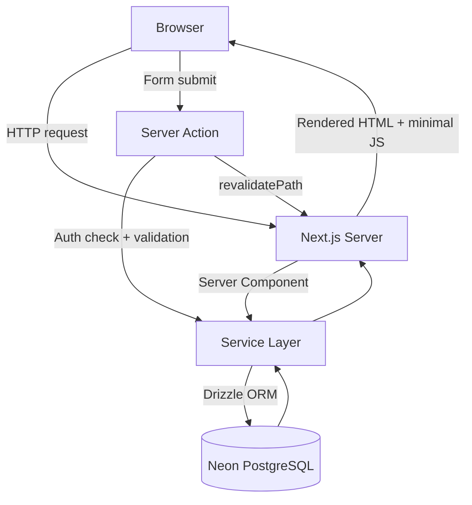
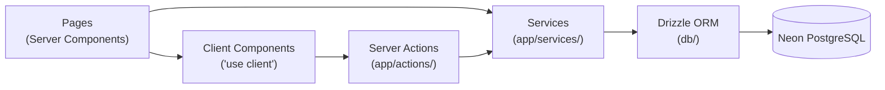
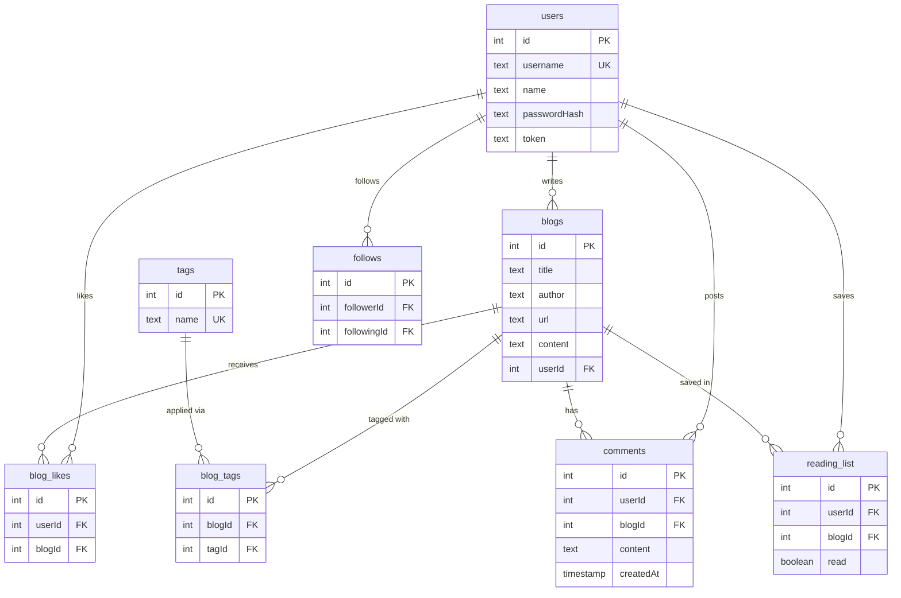
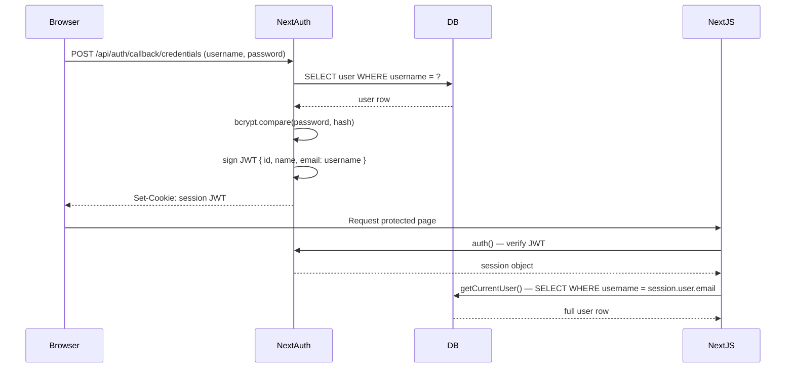

# Curate

A place to save, share, and discover blog posts that matter. Write posts with a markdown editor, tag and filter them, like the ones you love, comment and discuss, follow writers, and get a personalized feed.

Live at **[curate-wine.vercel.app](https://curate-wine.vercel.app)**

---

## Tech Stack

| Layer | Technology |
|---|---|
| Framework | Next.js 16 (App Router) |
| Language | TypeScript |
| Database | PostgreSQL via Neon (serverless) |
| ORM | Drizzle ORM |
| Auth | NextAuth v5 — JWT + bcrypt credentials |
| Styling | Tailwind CSS v4 + shadcn/ui |
| Validation | Zod (server actions) |
| Testing | Playwright E2E |
| CI/CD | GitHub Actions |

---

## Architecture

### Request Flow

Every page defaults to a Server Component. Client Components are used only where interactivity is required (forms, like button, tag input, markdown editor). Data fetching happens directly in the server component tree — no API layer for internal reads.



### Layered Architecture



- **Pages** — async Server Components that fetch data directly from the service layer and pass it to Client Components as props
- **Client Components** — forms, interactive UI (like button, tag input, comment form), marked with `"use client"`
- **Server Actions** — handle mutations: authenticate the user, validate input, call services, revalidate cache
- **Services** — thin data-access wrappers over Drizzle. No business logic, no auth — just queries
- **Drizzle ORM** — type-safe schema and query builder, migrations tracked in `/drizzle`

---

## Database Schema



---

## Auth Flow

NextAuth v5 Credentials provider with JWT session strategy. The `username` field is stored in the JWT's `email` slot (a known workaround for NextAuth's fixed User type). `getCurrentUser()` re-fetches the full user from the database on each auth-required request using `session.user.email` as the username lookup key.



---

## Key Features

- **Markdown editor** — `@uiw/react-md-editor` with live preview, rendered server-side via `react-markdown` + `rehype-sanitize`
- **Optimistic likes** — `useOptimistic` updates the count instantly before the server responds
- **Tag system** — many-to-many `tags ↔ blogs` via `blog_tags`, filterable from the blog list
- **Comments** — threaded per-blog, author-only delete enforced at the DB query level (`WHERE id = ? AND user_id = ?`)
- **Follow system** — `follows` junction table, personalized `/feed` page showing posts from followed users
- **Reading list** — per-user unread/read tracking with mark-as-read
- **Pagination** — offset-based with `LIMIT/OFFSET` at the DB level, filter and tag params preserved in page URLs
- **SEO** — `generateMetadata()` on blog and user profile pages, `title.template` in root layout

---

## Project Structure

```
app/
  actions/          # Server actions (blogs, comments, follows, readingList, users)
  api/              # Route handlers (auth, blogs REST, testing endpoints)
  blogs/            # Blog list, detail, new, edit pages
  components/       # Shared components (NavBar, MarkdownEditor, TagInput, etc.)
  feed/             # Personalized feed page
  me/               # Profile and reading list page
  services/         # Data access layer (blogs, comments, follows, tags, users)
  users/            # Users list and profile pages
components/
  ui/               # shadcn/ui primitives (Button, Card, Input, Badge)
db/
  schema.ts         # Drizzle table definitions and relations
  index.ts          # Database client (Neon serverless)
drizzle/            # SQL migrations
tests/              # Playwright E2E tests
```

---

## Getting Started

### Prerequisites

- Node.js 20+
- A [Neon](https://neon.tech) PostgreSQL database

### Setup

```bash
# Install dependencies
npm install

# Create .env.local
DATABASE_URL=your_neon_connection_string
AUTH_SECRET=any_random_secure_string

# Apply migrations
npx drizzle-kit push

# Seed sample data (optional)
npm run seed

# Start dev server
npm run dev
```

### Running Tests

Tests use a separate test database. Set `DATABASE_URL` in `.env.test` pointing to a test Neon branch.

```bash
npm run test:e2e
```

---

## License

MIT
